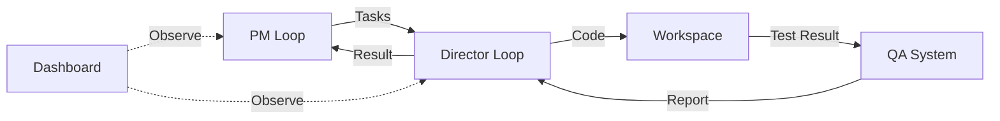

# HarborPilot

HarborPilot 是一套“**PM 规划 → Director 执行 → QA 校验 → Dashboard 可视化**”的自动化脚本项目。
默认 **PM 用 Codex（更聪明）**，**Director 用本地 Ollama（更省成本）**，并支持多 profile 的提示词模板化管理。



## Quickstart

```bash
# setup
cd desktop
npm install

# dev
npm run dev

# test
npm run test

# build
npm run build
```

---

## 1. 快速开始 (Quick Start)

### 1.1 启动 Dashboard (推荐)

最简单的上手方式是使用可视化面板：


在界面中：
1.  选择 **Workspace** (必须包含 `docs/` 目录)。
2.  设置 **PM Backend** (推荐 Codex) 和 **Director Model** (推荐 Ollama)。
3.  点击 **Start PM** 开始规划循环。

### 1.2 CLI 运行

如果你喜欢命令行：

```bash
# 1. 运行 PM (生成任务)
python loops/loop-pm.py --workspace /path/to/repo

# 2. 运行 Director (执行任务)
python loops/loop-director.py --workspace /path/to/repo --iterations 1
```

---

## 2. 产物在哪里看？

所有运行产物默认生成在 workspace 下的 `.harborpilot/runtime/` 目录 (建议配置 `.harborpilot/runtime/runs/` 指向内存盘)：

*   **任务与计划**: `PM_TASKS.json`, `PLAN.md`
*   **执行结果**: `DIRECTOR_RESULT.json`, `RUNLOG.md`
*   **QA 报告**: `QA_RESPONSE.md`
*   **对话记录**: `DIALOGUE.jsonl` (Dashboard 读取此文件)
*   **备忘录**: `memos/` (任务完成后的归档)

> **提示**: 推荐配置 `HARBORPILOT_STATE_TO_RAMDISK=1` 将此目录指向内存盘，保持项目整洁。

---

## 3. 六条系统不变量 (System Invariants)

为了防止系统在长期迭代中失控，HarborPilot 遵循以下 6 条不可打破的约束：

1.  **合同不可变 (Immutable Contract)**
    `PM_TASKS.json` 中的 `task goal` 和 `acceptance_criteria` 不允许 Director 或记忆模块改写。执行过程中只能追加 `evidence`，不能篡改原始目标。

2.  **事实流 Append-Only**
    `events.jsonl` 只能追加，**严禁覆盖**。任何“修正”或“回滚”操作都必须产生新的 Event，保留完整的历史记录。

3.  **Run ID 全局唯一**
    所有产物、引用 (refs)、备忘录 (memo)、轨迹 (trajectory) 都必须以 `run_id` 为主键串联。无 `run_id` 的孤儿数据将被视为无效。

4.  **观测优先 (UI Read-Only)**
    Dashboard UI **只读**。UI 不产生决策、不修改状态、不直接操作代码。所有状态变更必须由 CLI Loop 产生。

5.  **可回放 (Replayable)**
    仅依靠 `events.jsonl` + `trajectory.json` + `artifacts paths` 必须能完全重建关键过程。不应依赖任何未记录的外部状态。

6.  **失败可定位 (Traceable Failure)**
    任何失败都必须能在 **3 跳 (Hops)** 内定位到：
    *   哪个 Phase (Tool/Patch/QA)？
    *   依据哪条 Evidence？
    *   哪个工具输出了错误信息？

---

## 4. 更多文档

*   **[架构文档 (Architecture)](docs/architecture.md)**
    *   工程师必读。详解状态机、事件模型、Policy 合并规则、并发约束与 Smart 视图解析原理。
*   **[参考手册 (Reference)](docs/reference.md)**
    *   查字典。包含 CLI 参数全集、目录结构索引、工具清单 (Tools) 及产物说明。
*   **[Troubleshooting](docs/reference.md#6-ramdisk-机制-faq)**
    *   常见问题排查。

---

## 5. 依赖要求

*   Python 3.10+
*   **PM**: 推荐 Codex CLI (默认)
*   **Director**: 推荐 Ollama CLI (默认)
*   可选: `lancedb` (长期记忆), `flet` (Dashboard UI)
