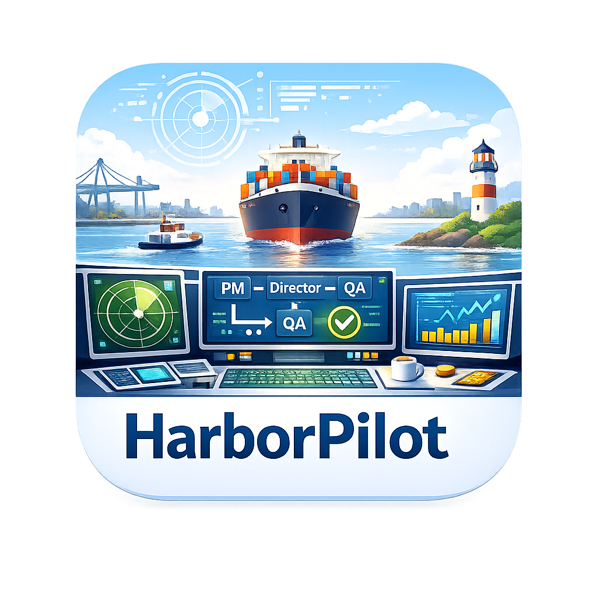
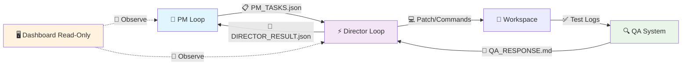

<div align="center">

# 🚢 HarborPilot



[](https://python.org)
[](LICENSE)
[]()

**单人 · 本地优先 · 固定成本优先 · 无人值守自动化编程指挥台**

PM 规划 → Director 执行 → QA 校验 → Dashboard 可视化（Mission Control）

---

HarborPilot 的核心不是"更花哨的 Agent"，而是**面向现实**：

以 **本地推理（电费）** + **包月/订阅 CLI（固定成本）** 为主，

构建一个**可控、可追溯、可回放、可长期长跑**的个人软件工厂。

</div>

---

## 📌 目录

- [🎯 项目定位](#-项目定位)
- [✨ 独特优势与特色](#-独特优势与特色)
- [✅ 已有功能一览](#-已有功能一览)
- [🚀 快速开始](#-快速开始)
- [🏗️ 系统架构](#️-系统架构)
- [📁 产物与目录结构](#-产物与目录结构)
- [⚖️ 系统不变量（v2：核心 6 + 修正案 3）](#️-系统不变量)
- [🧠 拟人化核心与 Glass Mind](#-拟人化核心与-glass-mind)
- [🤖 模型要求与兼容性](#🤖-模型要求与兼容性)
- [🎛️ 模型路由与接入验证](#️-模型路由与接入验证)
- [📊 用量与成本观测](#-用量与成本观测)
- [🗣️ Inner Voice（自言自语）](#️-inner-voice自言自语)
- [🆚 与行业工具的差异](#-与行业工具的差异)
- [🗺️ Roadmap：工具 × 游戏](#️-roadmap工具--游戏)
- [📚 文档](#-文档)
- [🤝 贡献与许可](#-贡献与许可)

---

## 🎯 项目定位

HarborPilot 是一款**单人工具**：

- 既是 **无人值守自动化编程工具**（可长期跑、可回放、可定位）
- 也将演进为一款 **"经营 + 叙事"的游戏化指挥台**（基于拟人化核心延展）

### 成本哲学（Reality-first）

| 通道           | 说明                      | 边际成本                       |
| -------------- | ------------------------- | ------------------------------ |
| 🖥️ **LOCAL**   | 本地模型（Ollama 等）     | ≈ 电费                         |
| 📦 **FIXED**   | 订阅/包月 CLI（Codex 等） | 固定成本，适合长跑             |
| 💳 **METERED** | 标准化 HTTPS API          | 受控"紧急通道"，**默认强门禁** |

---

## ✨ 独特优势与特色

### 1️⃣ 双循环 + 合同机制：把 Agent 变成"可管理的工程协作"

| 循环              | 职责                                          |
| ----------------- | --------------------------------------------- |
| **PM Loop**       | 高阶规划、拆解、写验收（Acceptance Criteria） |
| **Director Loop** | 取证 → 计划 → 执行 → 复核 → QA                |

**合同**：通过 `PM_TASKS.json` 严格通信，配合"合同不可变"约束，避免目标漂移与越权改动。

### 2️⃣ 事实流 Append-Only + 可回放：长期无人值守的底座

- `events.jsonl` 记录所有关键原子事件（工具调用、文件读写、QA 输出…），**只追加不覆盖**
- `run_id` 串联所有产物与引用，支持**回放、对比、复盘与归因**
- 失败要求在 **3 hops** 内定位到 Phase → Evidence → Tool Output

### 3️⃣ Mission Control Dashboard：以"观测与追踪"为核心

- UI 强调 **Read-Only 观测优先**（不在 UI 里直接做决策/改代码）
- **Process Monitor / Smart View / 虚拟滚动**：百万行日志仍可流畅查看
- **Glass Mind**：透明显示记忆检索、反思触发、上下文构建过程

### 4️⃣ 拟人化核心：Memory / Reflection / Persona（不是噱头，是稳定性）

| 模块                   | 能力                                    |
| ---------------------- | --------------------------------------- |
| **Memory（记忆）**     | 长期记忆（默认基于 LanceDB）            |
| **Reflection（反思）** | 从历史 run 抽象启发式规则，减少重复踩坑 |
| **Persona（人设）**    | 约束风格与禁忌，强化"职责边界"          |
| **Glass Mind**         | 把"内在过程"投影成可读的观测面板        |

---

## ✅ 已有功能一览

> 本节按"当前已具备/已在工程化落地"的能力列举；后续增强见 [Roadmap](#️-roadmap工具--游戏)。

### 工作流闭环

- PM 规划 → Director 执行 → QA 校验 → Dashboard 可视化
- 结构化任务合约：`PM_TASKS.json`
- Director 执行产物：`DIRECTOR_RESULT.json`、`QA_RESPONSE.md`、`RUNLOG.md`

### 可观测性与高性能 UI

- Mission Control 暗色系作战台 UI
- **Process Monitor** 侧边栏：状态/日志/变更追踪
- **Smart View**：将终端输出结构化渲染（增量解析、JSON 块、cmd/exit 等卡片化）
- **虚拟滚动**（Virtual Scrolling）：面向超长日志与密集事件

### 工具链与工程化

- **repo 工具**：tree / rg / slice read / diff
- **Tree-sitter**：符号定位、结构化替换/插入
- **QA**：ruff / mypy / pytest / jsonschema / pydantic 校验
- 端口策略、风险门禁、（可选）回滚与自动修复策略

### Turbo Mode (Beta) ⚡

> **警告**：该功能处于 Beta 测试阶段，专为双 3090 Ti 等高性能工作站设计。请参考 [Turbo 硬件加速文档](docs/turbo_gpu.md) 进行配置。

- **God Mode 架构**：集成 RAPIDS (cuDF/cuml) + SGLang + PyArrow + Tree-sitter
- **能力**：
  - 正则/文本处理 100x 加速 (GPU)
  - 代码库 3D 可视化 (cuML/cugraph)
  - 本地推理加速 (Radix Attention) & 100% JSON Schema 约束
  - 零拷贝 IPC 通信
- **状态**：默认关闭，需在 Settings 中显式开启；支持优雅降级回 CPU。

### 拟人化核心

- Memory / Reflection / Persona
- Glass Mind 透明思维侧栏（记忆/反思/上下文构建可视化）
- Inner Voice（内心独白 / Thinking 投影）

---

## 🚀 快速开始

### 0️⃣ Python 虚拟环境（推荐）

```bash
# Windows
infrastructure/setup/setup_venv.bat

# macOS / Linux
bash infrastructure/setup/setup_venv.sh
```

> 如果启动时提示缺少 .venv，请先执行上述脚本。

### 1️⃣ 启动 Dashboard（推荐）

```bash
# 安装依赖
npm install

# 开发模式（Vite + Electron）
npm run dev

# 测试
npm run test

# 构建
npm run build
```

在界面中：

1. 选择 **Workspace**（缺少 `docs/` 会触发初始化引导）
2. 设置 **PM / Director / QA** 模型
3. 点击 **Start PM** → 进入闭环

> 如本机具备 NVIDIA GPU 且已安装 RAPIDS/cuDF，可在 Settings → Turbo 模式启用 GPU 加速。

### 2️⃣ CLI 运行

```bash
# PM：生成任务合约
.venv/bin/python src/backend/scripts/loop-pm.py --workspace /path/to/repo

# Director：执行任务
.venv/bin/python src/backend/scripts/loop-director.py --workspace /path/to/repo --iterations 1
```

> Windows 请使用 `.venv\\Scripts\\python.exe`。

### 🧰 故障排除（虚拟环境）

- 启动时提示缺少 `.venv`：先运行 `infrastructure/setup/setup_venv.bat` / `infrastructure/setup/setup_venv.sh`
- 依赖不完整警告：重新执行脚本以补装依赖
- 想使用系统 Python：设置 `HARBORPILOT_PYTHON` 指向自定义解释器

---

## 🏗️ 系统架构



### 关键设计点

| 设计                           | 说明                                                         |
| ------------------------------ | ------------------------------------------------------------ |
| **Control/Execute Separation** | PM 定义合约，Director 执行合约                               |
| **Event Sourcing**             | 事实流（events.jsonl）+ 投影层（DIALOGUE/RUNLOG/Smart View） |
| **数据即真相，视图即表现**     | 单一数据源保存真实状态；UI/List/Visual 仅做投影，不维护第二份真相 |
| **Policy 合并**                | CLI > Task Overrides > Policy File > Env Vars > Defaults     |
| **成本模型**                   | LOCAL/FIXED/METERED 三类通道治理                             |

---

### 🧘 设计哲学类比（可选阅读）

> 以下为工程设计类比，用于帮助理解“单一数据源 + 多视图投影”，不涉及宗教教义阐释。

| 架构原则             | 佛学类比         | 工程语义 |
| -------------------- | ---------------- | -------- |
| **数据即真相**       | **法性 / 实相**  | 系统以单一、可验证的数据作为判断基准，不以界面状态为真相。 |
| **视图即表现**       | **相 / 现象**    | List / Visual / 报表等仅是同一真相在不同场景下的呈现。 |
| **适配器转换**       | **方便法门**     | 通过不同 Adapter 让不同受众理解同一数据本质。 |
| **单一真相源**       | **不二法门**     | 避免多源分裂与同步冲突，保持一致性、完整性与可回放性。 |

---

### 🔁 因果闭环（从任务到证据）

**因（Cause）：**
用户需求、PM 任务定义、Director 执行计划、策略配置（Policy）这些“触发行动的条件”。

**缘（Condition）：**
当前代码库状态、工具可用性、模型能力、成本模型（LOCAL/FIXED/METERED）等“使因得以发生作用的环境”。

**果（Effect）：**
可验证、可追溯的现实产物：`events.jsonl`、`DIRECTOR_RESULT.json`、补丁、测试报告、失败码、轨迹索引等。

**业（Action Trace）：**
每一次工具调用、文件读写、测试执行都会留下记录；这些记录决定最终结果质量与风险画像。

**因果闭环（可回放）：**
从“任务起因”到“执行行为”再到“结果产物”，能通过 `run_id + events + artifacts` 反向追溯，这就是工程化的“因果可证”。

---

## 📁 项目目录结构

```
HarborPilot/
├── docs/                      # 集中式文档
│   ├── agents/               # Agent 行为规范 (AGENTS_V*.md)
│   ├── agent/                # Agent 架构与实现文档
│   ├── architecture/         # 设计文档 (design_system_v2.md)
│   ├── testing/              # 测试指南 (GUIDE.md)
│   ├── human/                # 面向用户的文档
│   ├── product/              # 产品规格与需求
│   └── temp/                 # 临时计划文档
├── infrastructure/            # 基础设施与脚本
│   ├── agent_core/           # Agent 核心工具 (atomic_commit, precision_editor)
│   ├── scripts/              # 运行脚本 (run-electron.js)
│   ├── setup/                # 环境设置脚本
│   └── tools/                # CLI 工具集
├── src/                       # 源代码
│   ├── backend/              # FastAPI Python 后端
│   │   ├── app/              # FastAPI 应用 (routers, services)
│   │   ├── core/             # 核心逻辑 (harborpilot_loop)
│   │   ├── scripts/          # 脚本 (loop-pm.py, loop-director.py)
│   │   ├── services/         # 业务服务
│   │   └── lancedb_store.py  # LanceDB 记忆存储
│   ├── frontend/             # React + Vite 前端
│   │   └── src/              # 前端源代码
│   └── electron/             # Electron 主进程
├── tests/                     # 测试套件
├── package.json               # 项目配置
└── README.md                  # 本文件
```

## 📁 产物与目录结构

默认运行产物输出到（建议可指向 RAMDISK）：`.harborpilot/runtime/`

| 文件/目录              | 说明                                           |
| ---------------------- | ---------------------------------------------- |
| `PM_TASKS.json`        | PM 任务合约（目标、AC、证据需求、策略覆盖）    |
| `PLAN.md`              | 规划与拆解（人类可读）                         |
| `DIRECTOR_RESULT.json` | 执行结果摘要（状态、失败码、风险等）           |
| `RUNLOG.md`            | 详细运行日志                                   |
| `QA_RESPONSE.md`       | QA 报告                                        |
| `DIALOGUE.jsonl`       | 拟人化叙事流（Dashboard 展示，含 Inner Voice） |
| `events.jsonl`         | 事实流（append-only，回放/评测/归因）          |
| `trajectory.json`      | 轨迹索引（串联事件与产物）                     |
| `memos/`               | 备忘录归档（任务完成后的总结）                 |

> 💡 **RAMDISK**：推荐配置 `HARBORPILOT_STATE_TO_RAMDISK=1` 将 runtime 指向内存盘（更快、更干净）。

---

## ⚖️ 系统不变量（v2：核心 6 + 修正案 3）

> 这组不变量是 HarborPilot 的"**系统宪法**"。详见 [完整文档](docs/agent/invariants.md) 和 [Agent 行为规范](docs/agents/AGENTS_V25.md)。

| #   | 不变量                       | 一句话说明                                                  |
| --- | ---------------------------- | ----------------------------------------------------------- |
| 1️⃣  | **合同不可变**               | `PM_TASKS.json` 的 goal/AC 不可被执行侧改写，只能追加证据   |
| 2️⃣  | **事实流 Append-Only**       | `events.jsonl` 只能追加，修正/回滚必须新增事件              |
| 3️⃣  | **Run ID 全局唯一**          | 产物/引用/轨迹必须以 `run_id` 串联，孤儿数据无效            |
| 4️⃣  | **观测优先（UI Read-Only）** | 运行态 UI 不修改任务/代码/状态；控制面只在 Loop             |
| 5️⃣  | **可回放**                   | 仅依赖 events + trajectory + artifacts paths 能重建关键过程 |
| 6️⃣  | **失败可定位**               | 失败必须在 3 hops 内定位到 Phase → Evidence → Tool Output   |
| 7️⃣  | **原子写入与一致性读取**     | 关键状态文件写入必须原子化，读取永不读到半截                |
| 8️⃣  | **记忆必须可溯源**           | memory/reflection 不能当事实，只能当建议，且必须带 refs     |
| 9️⃣  | **编码统一性**               | 所有文本读写必须显式 UTF-8，防止乱码破坏证据                |

> 💡 **例外**：Setup/Onboarding 模式允许"受限写入"（仅写 `docs/` 与 `config`），且同样写入事件流以审计。

---

## 🧠 拟人化核心与 Glass Mind

### Memory（记忆）

- 默认采用 **LanceDB** 作为长期记忆后端（面向单人长期项目的经验积累）
- **混合检索**：相关性 / 时效性 / 重要性

### Reflection（反思）

- 从历史 run/memos 抽象启发式规则
- 目的不是"更像人"，而是**减少重复踩坑、提高稳定性**

### Persona（人设）

- 为 PM/Director/QA/Docs 等角色定义**风格与禁忌**
- 强化"职责边界"，减少漂移

### Glass Mind（透明思维）

UI 侧边栏展示：

- 检索到了哪些记忆？
- 触发了哪些反思？
- 上下文如何构建？

> 强化"**可解释性**"与"**可控性**"

---

## 🤖 模型要求与兼容性

HarborPilot 作为自动化编程指挥台，对接的模型必须满足以下**核心要求**：

### 1. 思考过程支持（Thinking Support）

**必要性**：PM 和 Director 角色需要展示推理过程，确保决策透明可追溯。

**技术要求**：
- ✅ 支持 `thinking`、`reasoning_summary` 或类似标签输出
- ✅ 能够输出结构化的思考过程
- ✅ 支持工具调用前的推理说明

**期望的模型输出格式**：
```
<thinking>
我需要分析用户需求，制定实施计划...
1. 理解问题本质
2. 制定解决方案
3. 准备工具调用
</thinking>

<answer>
具体的实施步骤和代码...
</answer>
```

### 2. 流式实时输出（Streaming Support）

**必要性**：提供实时反馈，提升用户体验，支持长时间任务的进度监控。

**技术要求**：
- ✅ 支持 Server-Sent Events (SSE) 或类似流式协议
- ✅ 支持逐 token 输出，延迟 < 100ms
- ✅ 兼容 OpenAI SDK 的流式接口
- ✅ 支持中断和恢复机制

### 推荐模型列表

| 模型 | Provider | Thinking | Streaming | 推荐度 | 说明 |
|------|----------|----------|-----------|--------|------|
| **GPT-4** | OpenAI | ✅ | ✅ | ⭐⭐⭐⭐⭐ | 原生支持，最佳体验 |
| **Claude-3** | Anthropic | ✅ | ✅ | ⭐⭐⭐⭐⭐ | 强推理能力 |
| **Kimi-K2** | Moonshot | ✅ | ✅ | ⭐⭐⭐⭐ | OpenAI 兼容，性价比高 |
| **MiniMax** | MiniMax | ✅ | ✅ | ⭐⭐⭐⭐ | 支持中文优化 |
| **Codex CLI** | OpenAI | ✅ | ✅ | ⭐⭐⭐⭐⭐ | 固定成本，适合长跑 |
| **Llama-3** | Ollama | ⚠️ | ✅ | ⭐⭐⭐ | 需要 prompt 工程 |
| **Gemini CLI** | Google | ⚠️ | ✅ | ⭐⭐⭐ | 需要格式转换 |

### Provider 开发要求

```python
class BaseProvider:
    async def invoke_stream(self, prompt: str, model: str, config: Dict[str, Any]) -> AsyncGenerator[str, None]:
        """必须实现流式输出"""
        pass

    def supports_thinking(self, model: str) -> bool:
        """检查模型是否支持 thinking"""
        pass
```

---

## 🎛️ 模型路由与接入验证

> 目标：无论接入命令行 LLM、本地运行时、还是第三方 HTTPS API，都必须能在 UI 中完成**接入验证与胜任性测试**，确保"可用且胜任"。

**面试模式（Interview Mode）**：

- LLM 设置以“面试大厅 → 面试进行中”组织测试流程，用户作为面试官。
- **PM / Director** 为核心岗位，必须使用支持 thinking/reasoning 的模型；检测失败将阻止进入 READY。
- **QA / Docs** 为辅助岗位，thinking 可选但会提示建议。
- 面试通过后，角色可绑定任意已配置模型，不再固定到单一后端实现。

### 角色路由（Role Routing）

HarborPilot 支持为不同角色选择不同模型：

- **PM** / **Director** / **QA** / **Docs Generator**

### Provider 类型（统一抽象）

| 类型                        | 示例                                      | 成本通道          | Thinking | Streaming | 推荐度 |
| --------------------------- | ----------------------------------------- | ---------------- |----------|-----------|--------|
| **CLI Provider**            | Codex CLI、Gemini CLI                     | FIXED            | ✅       | ✅        | ⭐⭐⭐⭐⭐ |
| **Local HTTP Runtime**      | Ollama、LM Studio、Jan、llama.cpp         | LOCAL            | ⚠️       | ✅        | ⭐⭐⭐ |
| **Standard HTTPS Provider** | OpenAI-compatible API（OpenAI / MiniMax） | METERED（强门禁） | ✅       | ✅        | ⭐⭐⭐⭐ |

> ⚠️ **选择 Provider 时必须确认 Thinking 和 Streaming 支持**，否则将无法通过 HarborPilot 的胜任性测试。

#### Codex CLI 接入（exec 模式）

推荐在 CLI Provider 中使用 `codex exec` + `--json` 的事件流输出，便于解析 thinking 与工具事件。

示例参数：

```bash
codex exec --skip-git-repo-check --color never --model {model} --sandbox danger-full-access --json {prompt}
```

- `--json` 输出 newline-delimited JSON 事件流，适合 UI/脚本解析。
- `--ask-for-approval` / `--sandbox` / `--add-dir` 对应权限与沙箱策略。
- `--output-schema` 可用来校验最终输出结构。

MiniMax（OpenAI-compatible）配置示例：

- Base URL：`https://api.minimax.io/v1`
- API Key：在 UI 的 LLM 设置里保存到 keychain（provider id: `minimax`）

MiniMax（Anthropic-compatible）配置示例：

- Base URL：`https://api.minimax.io/anthropic`
- API Key：在 UI 的 LLM 设置里保存到 keychain（provider id: `minimax_anthropic`）

### 接入验证（必做）

每个 Provider/Role 都必须支持 **"Test"**：

#### Layer 1：可用性测试（Connectivity & Capability）

- ✅ 能启动/连通（health）
- ✅ model id 可用
- ✅ 能回答一个最小问题（response 非空）
- ✅ **流式输出测试**：能逐 token 输出，延迟 < 100ms
- ✅ 超时/错误处理可控
- ✅ usage/tokens：能取则取，不能取则标估算

#### Layer 2：胜任性测试（Role Qualification）

| 角色 | 胜任标准 | Thinking 要求 | Streaming 要求 |
|------|----------|---------------|----------------|
| **PM** | 能输出结构化任务与 AC | **必须** | **必须** |
| **Director** | 证据优先、计划可执行、不臆造文件 | **必须** | **必须** |
| **QA** | 严格 PASS/FAIL + 原因与证据引用 | 推荐 | **必须** |
| **Docs** | 按模板生成，不编造事实 | 推荐 | **必须** |

**核心能力检测**：

- PM/Director 必须检测到 thinking/reasoning 信号（如 `<thinking>` / `reasoning_summary` / `<think>`）。
- 所有角色必须支持流式输出。
- 未满足则视为不胜任并阻止进入 READY。
- QA/Docs 的 thinking 能力不强制，但会给出建议提示。

- ✅ 通过 → role **READY**
- ❌ 未通过 → role **BLOCKED**（对应运行按钮置灰，跳转到 Test Center）

---

## 📊 用量与成本观测

> HarborPilot 不崇拜 token，但必须"**可观测**"。
>
> 对单人长跑而言，真正重要的是：**成本通道（LOCAL/FIXED/METERED）+ 调用次数 + 延迟 +（能拿到则记录 tokens）**。

### 计划中的用量观测（与 Mission Control 融合）

| 组件                          | 功能                                  |
| ----------------------------- | ------------------------------------- |
| **Header Usage HUD**          | TOKENS / CALLS / LATENCY / BUDGET     |
| **Process Monitor Usage Tab** | 按角色/模式/模型分解 + 时间轴         |
| **Budget Gate**               | 对 METERED 通道默认强门禁，避免误烧钱 |

---

## 🗣️ Inner Voice（自言自语）

> 可选增强：从模型输出中提取 "thinking / reasoning summary / `<think>…</think>`" 等内容，作为角色的"内心独白"展示在对话流中。

### 设计原则

| 原则                 | 说明                         |
| -------------------- | ---------------------------- |
| **只展示已输出内容** | 不试图还原隐藏推理链         |
| **强制脱敏/裁剪**    | 防泄露 prompt/密钥/隐私      |
| **默认折叠显示**     | 作为 Glass Mind 的"旁路投影" |

### 用途

- 🎭 更沉浸的拟人化体验（像"自言自语"）
- 🔍 更强的可解释性：你能看到它"为什么这样想"（摘要级）

> 💡 示例独白："我需要先读哪些文件…我怀疑类型定义重复…我打算先跑 type-check…"

---

## 🆚 与行业工具的差异

> HarborPilot 的差异化不是"更炫更全"，而是更像 **"可运营的个人软件工厂"**。

### 与 IDE 一体化助手/代理对比

**代表产品**：Cursor、Windsurf、Cline、Continue、GitHub Copilot、Codex (IDE)

| 维度         | 他们通常强在哪里        | HarborPilot 的核心区别               |
| ------------ | ----------------------- | ------------------------------------ |
| **定位**     | 编辑器内的智能助手/插件 | **指挥台/流水线**，不是插件          |
| **交互模式** | 对话式辅助、Tab 补全    | **合同闭环 + 事实流可回放**          |
| **成本模型** | 通常按 token 计费       | **LOCAL/FIXED 优先**，METERED 强门禁 |
| **可追溯性** | 有限的历史记录          | **失败 3 hops 可定位**，全量事件流   |
| **无人值守** | 需要人工交互            | 支持**长期无人值守运行**             |

### 与终端/CLI 编码代理对比

**代表产品**：Claude Code、Aider

| 维度         | 他们通常强在哪里   | HarborPilot 的核心区别                 |
| ------------ | ------------------ | -------------------------------------- |
| **使用方式** | 终端交互、轻量灵活 | **Dashboard 可视化** + CLI 双模        |
| **状态管理** | 会话级别           | **run_id 全局串联**，跨会话追踪        |
| **可观测性** | 终端输出           | **Smart View + Glass Mind** 结构化展示 |
| **经验积累** | 有限               | **Memory/Reflection** 长期记忆         |

### 与云端交付型工程代理对比

**代表产品**：Devin、各类云沙箱 coding agent

| 维度         | 他们通常强在哪里   | HarborPilot 的核心区别          |
| ------------ | ------------------ | ------------------------------- |
| **执行环境** | 云端沙箱、并行执行 | **本地优先**，数据不出本机      |
| **成本结构** | 按使用量/订阅计费  | **电费 + 包月 CLI**，边际成本低 |
| **透明度**   | 云端黑箱           | **Glass Mind** 透明观测         |
| **控制力**   | 有限干预           | **合同不可变 + 6 条不变量**     |

### 与开源框架/平台对比

**代表产品**：OpenHands

| 维度         | 他们通常强在哪里          | HarborPilot 的核心区别            |
| ------------ | ------------------------- | --------------------------------- |
| **设计目标** | 通用 Agent 框架、生态扩展 | **软件开发闭环专精**              |
| **约束程度** | 灵活可配置                | **强约束 + 不变量**，减少失控     |
| **可复盘性** | 依赖日志                  | **事实流 + 轨迹索引**，完全可重建 |

### 与通用型自动化 Agent 对比

**代表产品**：Manus

| 维度         | 他们通常强在哪里       | HarborPilot 的核心区别            |
| ------------ | ---------------------- | --------------------------------- |
| **覆盖范围** | 多种任务类型、覆盖面广 | **更克制**，只做开发流水线        |
| **稳定性**   | 通用带来不确定性       | **强边界**，减少失控面            |
| **成本控制** | 通用成本模型           | **三分法**（LOCAL/FIXED/METERED） |

### 与新型管制塔/平台工具对比

**代表产品**：Antigravity、TRAE

| 维度         | 他们通常强在哪里 | HarborPilot 的核心区别                 |
| ------------ | ---------------- | -------------------------------------- |
| **定位**     | 企业级/团队协作  | **单人优先**，面向个人开发者           |
| **成本模型** | 企业订阅         | **电费/包月**，适合长期长跑            |
| **拟人化**   | 功能性设计       | **Memory/Reflection/Persona** 认知架构 |

### 差异总结

| 对比维度        | HarborPilot 的做法                    |
| --------------- | ------------------------------------- |
| 🎯 **成本模型** | LOCAL/FIXED 为主，METERED 强门禁      |
| 📜 **行为约束** | 合同 + 6 条不变量，边界写死           |
| 🔄 **可追溯性** | 事实流可回放，3 hops 可定位           |
| 🧠 **可解释性** | 拟人化核心 + Glass Mind + Inner Voice |
| 🖥️ **UI 体验**  | Mission Control 作战指挥台            |

> 💡 **一句话总结**：很多工具是"更聪明的助手/插件"，HarborPilot 是 **"更工程化的个人软件工厂"**。

---

## 🗺️ Roadmap：工具 × 游戏

> HarborPilot 将演进为 **"无人值守软件工厂 + 游戏化拟人世界"**
>
> 参考：[Game Dev Story](https://kairosoft.net/game/appli/gamedev.html)（公司经营）+ [AI Town](https://github.com/a16z-infra/ai-town)（角色叙事）

### 三视图形态（规划）

| 视图           | 定位       | 说明                       |
| -------------- | ---------- | -------------------------- |
| 🛰️ **Mission** | 生产指挥台 | 默认主视图，工具优先       |
| 🏢 **Studio**  | 办公室经营 | 工位、项目看板、成长与解锁 |
| 🏙️ **Town**    | 拟人化小镇 | 事实驱动的叙事与陪伴       |

### 核心规则（永不妥协）

- **Tool-first**：游戏层永远不干扰真实工程执行
- **事实驱动剧情**：剧情卡必须绑定 `run_id` / 事件引用，禁止"编造成功"
- **成长解锁带来现实收益**：更稳的 QA、更好的取证、更可控的流程

### 分阶段路线

| Phase       | 内容                                            |
| ----------- | ----------------------------------------------- |
| **Phase 0** | Story Cards、成就系统、角色名片（零侵入游戏化） |
| **Phase 1** | Studio 工位布局、项目进度可视化、成长系统       |
| **Phase 2** | Town 角色日常、城市事件系统                     |

### 通知与外部通道（展望）

- 计划引入 WhatsApp / Telegram 等通知通道，实时推送任务阶段完成报告与关键事件摘要。

---

## 📚 文档

| 文档                                                  | 说明                                   | 读者   |
| ----------------------------------------------------- | -------------------------------------- | ------ |
| [👀 人类文档入口](docs/human/README.md)               | 面向产品/业务/首次使用的阅读顺序       | 所有人 |
| [🤖 Agent 文档入口](docs/agent/README.md)             | 约束/证据链/工程细节（可执行）         | 工程师 |
| [🏗️ 架构文档](docs/agent/architecture.md)             | 状态机、事件模型、Context Engine       | 工程师 |
| [🧠 拟人化设计](docs/agent/anthropomorphic_design.md) | Memory/Reflection/Persona/Glass Mind   | 工程师 |
| [📖 参考手册](docs/agent/reference.md)                | CLI 参数、工具清单、环境变量、产物索引 | 开发者 |
| [📄 产品说明书](docs/product/product_spec.md)         | 产品定位、核心优势、行业对比           | 所有人 |
| [🧪 测试指南](docs/testing/GUIDE.md)                  | 测试环境搭建、运行命令                 | 测试   |

---

## 🤝 贡献与许可

欢迎提交 Issue / PR！

> 建议优先从：Docs、UI 投影、工具适配、测试用例、Doctor/Setup 规则开始

**License**：MIT

---

<div align="center">

## 🔖 现实主义三件套（优先落地建议）

如果你想把系统从"能跑"推进到"**可长期运营**"，优先级建议：

| #   | 模块                            | 说明                                     |
| --- | ------------------------------- | ---------------------------------------- |
| 1️⃣  | **Provider 接入 + Test Center** | 强门禁，确保模型可用且胜任               |
| 2️⃣  | **Usage/Cost-class 观测**       | LOCAL/FIXED/METERED 可见可控             |
| 3️⃣  | **Eval/回归对比**               | 升级不退化（成功率/耗时/调用次数可量化） |

---

**⭐ 如果这个项目对你有帮助，请给个 Star！**

Made with ❤️ by HarborPilot Team

</div>
