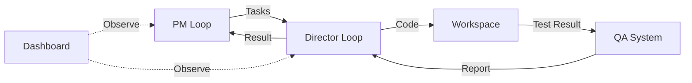

# HarborPilot

HarborPilot 是一个 **AI 驱动的自动化软件开发系统**，采用 "**PM 规划 → Director 执行 → QA 校验 → Dashboard 可视化**" 的完整工作流。项目使用 Python 后端 + Electron/React 前端的混合架构，支持多种 AI 模型后端（Codex/Ollama）。



---

## 核心架构亮点 (Core Highlights)

### 1. 双循环设计模式 (Dual-Loop Architecture)
*   **PM Loop**: 负责高阶任务生成和决策，如同项目经理。
*   **Director Loop**: 负责具体代码执行和质量保证，如同资深工程师。
*   两者通过结构化的 `PM_TASKS.json` 合约进行通信，职责分明。

### 2. 事件驱动架构 (Event-Driven)
*   **`events.jsonl`**: 记录所有原子操作（工具调用、文件读写），支持完整的执行回放和分析。
*   **`DIALOGUE.jsonl`**: 记录拟人化对话流，供 Dashboard 展示，提供良好的可观测性。
*   **`trajectory.json`**: 轨迹索引，串联所有运行产物。

### 3. 六条系统不变量 (System Invariants)
设计者制定了严格的系统约束，包括 **合同不可变性**、**事实流 Append-Only**、**Run ID 全局唯一** 等，确保系统在长期迭代中的稳定性与可追溯性。（详见下方第 4 节）

---

## 技术栈分析 (Tech Stack)

### 后端技术栈
*   **Python 3.10+**: 主要开发语言。
*   **模块化设计**: `modules/harborpilot-loop/` 包含核心业务逻辑。
*   **多 AI 后端支持**: 
    *   **Codex**: 推荐，更强的逻辑推理能力。
    *   **Ollama**: 本地部署，成本优化。
*   **数据持久化**: 
    *   **LanceDB**: 向量数据库，用于长期记忆。
    *   **JSON 文件**: 用于运行状态和短期记忆。

### 前端技术栈 (Dashboard)
*   **Electron**: 跨平台桌面应用壳。
*   **React 18**: UI 框架。
*   **TypeScript**: 保证类型安全。
*   **TailwindCSS**: 实用优先的样式框架。
*   **Radix UI**: 无头组件库，提供高质量的可访问性组件。
*   **Vite**: 高性能构建工具。

### 开发工具集成
*   **代码质量**: `ruff` (Linting), `mypy` (Type Checking), `pytest` (Testing)。
*   **数据校验**: `pydantic`, `jsonschema`。
*   **语法解析**: `tree_sitter` (AST 操作)。
*   **版本控制**: Git。

---

## 项目优势 (Advantages)

*   **架构设计优秀**: 清晰的职责分离（PM vs Director）和模块化设计。
*   **完整的工程化**: 从开发（Loop）、测试（QA）、部署到可视化（Dashboard）的全流程覆盖。
*   **可观测性强**: 详细的事件记录、状态追踪和实时日志流。
*   **扩展性好**: 支持多种 AI 后端切换，可自定义 Prompt 和策略。
*   **安全性考虑**: 内置端口策略、风险评估和代码回滚机制。

---

## 1. 快速开始 (Quick Start)

### 1.1 启动 Dashboard (推荐)

最简单的上手方式是使用可视化面板：

```bash
# setup
cd desktop
npm install

# dev
npm run dev
```

在界面中：
1.  选择 **Workspace** (必须包含 `docs/` 目录)。
2.  设置 **PM Backend** (推荐 Codex) 和 **Director Model** (推荐 Ollama)。
3.  点击 **Start PM** 开始规划循环。

### 1.2 CLI 运行

如果你喜欢命令行：

```bash
# 1. 运行 PM (生成任务)
python loops/loop-pm.py --workspace /path/to/repo

# 2. 运行 Director (执行任务)
python loops/loop-director.py --workspace /path/to/repo --iterations 1
```

---

## 2. 产物在哪里看？

所有运行产物默认生成在 workspace 下的 `state/ollama/` 目录 (建议配置 `state/runs/` 指向内存盘)：

*   **任务与计划**: `PM_TASKS.json`, `PLAN.md`
*   **执行结果**: `DIRECTOR_RESULT.json`, `RUNLOG.md`
*   **QA 报告**: `QA_RESPONSE.md`
*   **对话记录**: `DIALOGUE.jsonl` (Dashboard 读取此文件)
*   **备忘录**: `memos/` (任务完成后的归档)

> **提示**: 推荐配置 `HARBORPILOT_STATE_TO_RAMDISK=1` 将此目录指向内存盘，保持项目整洁。

---

## 3. 更多文档

*   **[架构文档 (Architecture)](docs/architecture.md)**
    *   工程师必读。详解状态机、事件模型、Policy 合并规则、并发约束与 Smart 视图解析原理。
*   **[参考手册 (Reference)](docs/reference.md)**
    *   查字典。包含 CLI 参数全集、目录结构索引、工具清单 (Tools) 及产物说明。
*   **[Troubleshooting](docs/reference.md#6-ramdisk-机制-faq)**
    *   常见问题排查。

---

## 4. 六条系统不变量 (System Invariants)

为了防止系统在长期迭代中失控，HarborPilot 遵循以下 6 条不可打破的约束：

1.  **合同不可变 (Immutable Contract)**
    `PM_TASKS.json` 中的 `task goal` 和 `acceptance_criteria` 不允许 Director 或记忆模块改写。执行过程中只能追加 `evidence`，不能篡改原始目标。

2.  **事实流 Append-Only**
    `events.jsonl` 只能追加，**严禁覆盖**。任何“修正”或“回滚”操作都必须产生新的 Event，保留完整的历史记录。

3.  **Run ID 全局唯一**
    所有产物、引用 (refs)、备忘录 (memo)、轨迹 (trajectory) 都必须以 `run_id` 为主键串联。无 `run_id` 的孤儿数据将被视为无效。

4.  **观测优先 (UI Read-Only)**
    Dashboard UI **只读**。UI 不产生决策、不修改状态、不直接操作代码。所有状态变更必须由 CLI Loop 产生。

5.  **可回放 (Replayable)**
    仅依靠 `events.jsonl` + `trajectory.json` + `artifacts paths` 必须能完全重建关键过程。不应依赖任何未记录的外部状态。

6.  **失败可定位 (Traceable Failure)**
    任何失败都必须能在 **3 跳 (Hops)** 内定位到：
    *   哪个 Phase (Tool/Patch/QA)？
    *   依据哪条 Evidence？
    *   哪个工具输出了错误信息？
