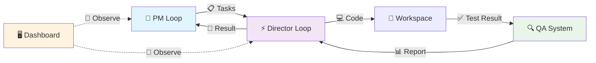

<div align="center">

# 🚢 HarborPilot

[](https://python.org)
[](LICENSE)
[]()

**一套"PM 规划 → Director 执行 → QA 校验 → Dashboard 可视化"的自动化脚本项目**

默认 **PM 用 Codex（更聪明）**，**Director 用本地 Ollama（更省成本）**，并支持多 profile 的提示词模板化管理。

</div>

---

## 📋 目录

- [🎯 核心特性](#-核心特性)
- [🚀 快速开始](#-快速开始)
- [🏗️ 系统架构](#️-系统架构)
- [📁 产物说明](#-产物说明)
- [⚖️ 系统不变量](#️-系统不变量)
- [📚 文档](#-文档)
- [🛠️ 依赖要求](#️-依赖要求)

---

## 🎯 核心特性

- 🧠 **智能规划**: PM 使用 Codex 进行任务规划
- ⚡ **本地执行**: Director 使用 Ollama 本地模型执行
- 🔍 **质量保证**: 内置 QA 系统进行代码校验
- 📊 **可视化面板**: 实时 Dashboard 展示执行状态
- 🔄 **多 Profile 支持**: 灵活的提示词模板管理
- 📝 **完整追踪**: 事件流记录，支持回放和调试

---

## 🚀 快速开始

### 🎨 启动 Dashboard (推荐)

最简单的上手方式是使用可视化面板：

```bash
# setup
cd desktop
npm install

# dev
npm run dev

# test
npm run test

# build
npm run build
```

在界面中：
1. 选择 **Workspace** (缺少 `docs/` 时会提示初始化向导)
2. 设置 **PM Backend** (推荐 Codex) 和 **Director Model** (推荐 Ollama)
3. 点击 **Start PM** 开始规划循环

### 💻 CLI 运行

如果你喜欢命令行：

```bash
# 1. 运行 PM (生成任务)
python loops/loop-pm.py --workspace /path/to/repo

# 2. 运行 Director (执行任务)
python loops/loop-director.py --workspace /path/to/repo --iterations 1
```

---

## 🏗️ 系统架构



---

## 📁 产物说明

所有运行产物默认生成在 workspace 下的 `.harborpilot/runtime/` 目录 (建议配置 `.harborpilot/runtime/runs/` 指向内存盘)：

| 📄 文件 | 📝 描述 |
|--------|--------|
| `PM_TASKS.json` | 🎯 任务与计划 |
| `PLAN.md` | 📋 详细规划文档 |
| `DIRECTOR_RESULT.json` | ⚡ 执行结果 |
| `RUNLOG.md` | 📝 运行日志 |
| `QA_RESPONSE.md` | 🔍 QA 报告 |
| `DIALOGUE.jsonl` | 💬 对话记录 (Dashboard 读取此文件) |
| `memos/` | 📚 备忘录 (任务完成后的归档) |

> 💡 **提示**: 推荐配置 `HARBORPILOT_STATE_TO_RAMDISK=1` 将此目录指向内存盘，保持项目整洁。

---

## ⚖️ 六条系统不变量

为了防止系统在长期迭代中失控，HarborPilot 遵循以下 6 条不可打破的约束：

### 1️⃣ 合同不可变 (Immutable Contract)
`PM_TASKS.json` 中的 `task goal` 和 `acceptance_criteria` 不允许 Director 或记忆模块改写。执行过程中只能追加 `evidence`，不能篡改原始目标。

### 2️⃣ 事实流 Append-Only
`events.jsonl` 只能追加，**严禁覆盖**。任何"修正"或"回滚"操作都必须产生新的 Event，保留完整的历史记录。

### 3️⃣ Run ID 全局唯一
所有产物、引用 (refs)、备忘录 (memo)、轨迹 (trajectory) 都必须以 `run_id` 为主键串联。无 `run_id` 的孤儿数据将被视为无效。

### 4️⃣ 观测优先 (UI Read-Only)
Dashboard UI **只读**。UI 不产生决策、不修改状态、不直接操作代码。所有状态变更必须由 CLI Loop 产生。

### 5️⃣ 可回放 (Replayable)
仅依靠 `events.jsonl` + `trajectory.json` + `artifacts paths` 必须能完全重建关键过程。不应依赖任何未记录的外部状态。

### 6️⃣ 失败可定位 (Traceable Failure)
任何失败都必须能在 **3 跳 (Hops)** 内定位到：
- 哪个 Phase (Tool/Patch/QA)？
- 依据哪条 Evidence？
- 哪个工具输出了错误信息？

---

## 📚 文档

| 📖 文档 | 🎯 读者 | 📝 描述 |
|--------|--------|--------|
| [🏗️ 架构文档](docs/architecture.md) | 👨‍💻 工程师 | 详解状态机、事件模型、Policy 合并规则、并发约束与 Smart 视图解析原理 |
| [📖 参考手册](docs/reference.md) | 🔍 查字典 | 包含 CLI 参数全集、目录结构索引、工具清单 (Tools) 及产物说明 |
| [🛠️ Troubleshooting](docs/reference.md#6-ramdisk-机制-faq) | 🚨 排障 | 常见问题排查 |

---

## 🛠️ 依赖要求

### 🔧 核心依赖
- **Python 3.10+** 
- **PM**: 推荐 Codex CLI (默认)
- **Director**: 推荐 Ollama CLI (默认)

### 📦 可选依赖
- `lancedb` (长期记忆)
- `flet` (Dashboard UI)

---

<div align="center">

## 🤝 贡献

欢迎提交 Issue 和 Pull Request！

## 📄 许可证

本项目采用 MIT 许可证 - 查看 [LICENSE](LICENSE) 文件了解详情。

---

<div align="center">

**⭐ 如果这个项目对你有帮助，请给个 Star！**

Made with ❤️ by HarborPilot Team

</div>
