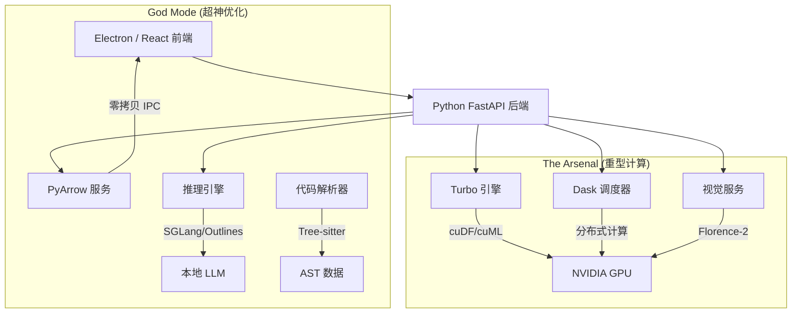

# Turbo 模式：GPU 加速架构

**HarborPilot Turbo 模式** 是一个专为本地开发任务设计的高性能硬件加速层，旨在利用 NVIDIA GPU（特别是针对双路 RTX 3090 Ti 配置）释放极致算力。它无缝集成了 **RAPIDS.ai** 生态系统、**本地 LLM 推理优化**以及**零拷贝（Zero-Copy）数据传输**技术，将标准的 AI 编程助手转变为“神级（God Tier）”开发环境。

## 1. 核心理念：优雅降级 (Graceful Degradation)

Turbo 模式遵循严格的 **“优雅降级”** 策略。

- **硬件检测**：如果检测到 NVIDIA 驱动、CUDA 以及必要的 Python 库（`rapids`, `sglang`, `cudf`），系统将自动激活专用的 GPU 加速路径。
- **自动回退**：如果缺少相关库或硬件不可用，系统将透明地回退到标准的 CPU 实现（使用标准 `re` 模块、`sklearn`、`transformers`），确保基本功能不受影响。

## 2. 架构栈

该架构被拆分为由后端 (`FastAPI`) 管理的专用服务层。



## 3. 组件参考

### 3.1 核心引擎 (`backend/services/turbo_engine.py`)

硬件加速的中央控制器。

- **正则加速**：利用 `cudf.Series.str.findall` 进行海量文本处理（在大型日志处理上可达 100 倍加速）。
- **上下文索引**：将向量嵌入的生成和聚类任务卸载到 `cuML`。
- **模拟 (Mocking)**：如果在非 GPU 开发机上运行，会自动模拟 GPU 数据以供测试。

### 3.2 军火库可视化 (`backend/routers/arsenal.py`)

专用于代码库理解的 3D 可视化流水线。

- **3D 代码地图**：使用 **UMAP** (GPU) 将文件向量投影到 3D 空间，并使用 **HDBSCAN** (GPU) 进行聚类。
- **力导向布局**：预留了 **cugraph** 接口，用于生成 ForceAtlas2 布局。
- **零拷贝传输**：使用 **PyArrow** 将二进制数据直接流式传输到前端 WebGL 查看器，绕过 JSON 序列化的性能瓶颈。

### 3.3 服务层

#### 数据核心 (Data Core)

- **TurboScheduler** (`turbo_scheduler.py`)：封装 `dask_cuda` 以管理 LocalCUDACluster。负责在多个 GPU 之间并行处理批处理任务（如代码库重建索引）。

#### 视觉能力 (Vision)

- **VisionService** (`vision_service.py`)：封装 VLM 模型（如 Florence-2），赋予 Agent “看见” UI 的能力。提供 `analyze_ui` 工具。

#### 精准工具 (Precision Tools - Phase 7)

- **QualityService** (`quality_service.py`)：封装 **Ruff**，提供毫秒级的代码 Lint 检查和自动格式化。
- **SearchService** (`search_service.py`)：封装 **Tantivy** (Rust内核)，提供高性能的 BM25 关键词搜索，作为向量搜索的补充。

#### 超神优化 (Hyper-Optimization - Phase 6)

- **InferenceEngine** (`inference_engine.py`)：
  - **Radix Attention**：通过 **SGLang** 集成，实现 KV-cache 复用（多轮对话秒回）。
  - **结构化解码**：通过 **Outlines** 集成，保证 Agent 输出的 JSON 100% 符合 Schema，杜绝格式错误。
- **CodeParser** (`code_parser.py`)：封装 **Tree-sitter** 进行健壮的 AST 提取，实现比正则更深层的“代码理解”。

## 4. 配置与验证

### 启用 Turbo 模式

1.  进入 **Settings (设置) -> Turbo Mode**。
2.  开启 "Enable Turbo Mode" 开关。
3.  系统将通过 `gpu_detector.py` 自动检测 GPU 能力。

### 诊断测试台 (Test Bench)

前端包含一个 **诊断与测试台 (Diagnostics & Test Bench)**（位于设置页），可用于手动验证：

- **Dask 集群**：启动/停止/查看状态。
- **视觉推理**：测试模拟或真实的推理流程。

### 单元测试

运行综合测试套件以验证优雅降级和服务可用性：

```bash
pytest backend/tests/test_hyper_opt.py
pytest backend/tests/test_arsenal.py
```

## 5. 依赖清单 (Dependency Manifest)

要解锁全部能力（God Mode），目标环境需安装以下库：

- `rapidsai` (包含了 cudf, cuml, cugraph)
- `dask-cuda`, `distributed`
- `sglang`
- `outlines`
- `pyarrow`
- `tree-sitter`
- `tantivy`
- `ruff`
